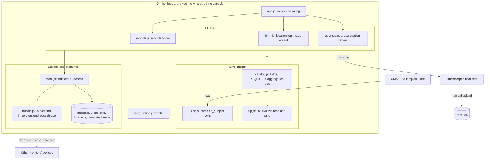
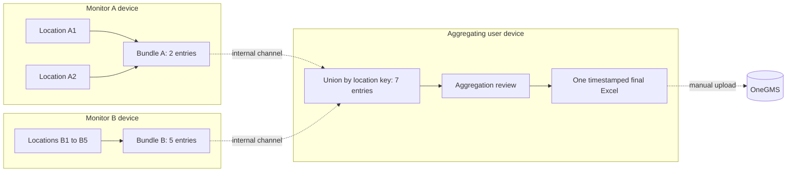
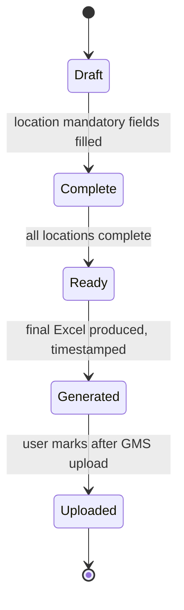

# GMS Field Monitoring Form: architecture and implementation plan

This document describes the target architecture for the multi-location, records-based
version of the tool, and the staged plan to get there from the current single-file app.

## 1. Goal

Today the app fills one OneGMS Field Site Monitoring (FSM) template and regenerates the
exact Excel for upload. The next version adds:

- A **mode choice** per project: single location (today's behaviour) or multiple locations.
- **Multi-location data collection** where different monitors, on different organization
  devices, each capture one or more locations of the same project.
- **Composable aggregation**: location entries can be exported, shared through internal
  channels, and merged by an aggregating user, who reviews the consolidated data and
  generates one final timestamped Excel for upload.
- A **records page** that tracks every project, its location entries, and the status of
  generated and uploaded files.
- **IndexedDB** storage to hold all of this reliably on the device.

## 2. Privacy and usage policy

The app remains fully local: no server, no analytics, a strict Content-Security-Policy that
makes outbound connections impossible, and self-hosted fonts (no third-party requests). The
records database lives only in the browser's IndexedDB on the device.

Because monitoring reports contain personal data (staff and persons-met names, contacts,
and red-flag findings), the following usage rules apply and are shown in the app:

- **Organization-issued devices only.** Enter and store monitoring data only on UN-issued
  devices, never personal devices.
- **Internal channels only.** Download and share exported files (drafts, location bundles,
  generated Excel, database backups) through internal UN channels only, never personal
  email or storage.
- **Optional passphrase encryption** for exported location bundles, so a monitoring team
  can share files between themselves with an added barrier. The team shares the passphrase
  between themselves through a separate channel.
- **Add to home screen / install** so the browser keeps the data (mitigates the iOS
  eviction risk), and keep a database backup.

## 3. Architecture and module structure

Everything runs in the browser on the device. There is no server: the only things that
cross the network are loading the static app from GitHub Pages, the user's own upload to
OneGMS, and the user choosing to share an export through an internal channel.



The single `index.html` is split into dependency-free ES modules, which GitHub Pages serves
natively and the CSP already allows (`script-src 'self'`). Externalizing the scripts also
lets us drop `'unsafe-inline'` from the CSP once the few inline handlers move to JS.

```
index.html            shell + markup
css/styles.css        all styles
js/zip.js             OOXML zip read/write (CompressionStream)
js/xlsx.js            template parse, fld_* named ranges, cell injection, full-calc flag
js/catalog.js         field definitions, REQUIRED set, per-field aggregation rules
js/form.js            render, validation, step wizard, read-only pre-filled fields
js/store.js           IndexedDB: projects, locations, bundles, generated files
js/aggregate.js       consolidation as a pure function + review model
js/records.js         records page + status workflow
js/bundle.js          export/import of location bundles + optional passphrase encryption
js/app.js             router + wiring + service worker registration
sw.js                 offline precache (updated for the new files)
manifest.webmanifest  installable PWA
```

## 4. Data model

The composability requirement ("one person aggregates 2 locations, another 5, and both can
still be combined") drives the model. The rule: **share the set of individual location
entries, never a pre-merged blob.** Aggregation is a pure function computed on demand, never
written back destructively.



Because the unit that travels is the set of entries (not a merged result), any chain of
hand-offs composes: 2 + 5 = 7, in any order, and re-importing the same bundle is harmless.

### Entities (IndexedDB object stores)

- **projects** `{ projectKey, projectCode, partner, templateHash, templateBytes, mode,
  numberAggRules, createdAt, updatedAt }`
  - `projectKey` = `projectCode` + `templateHash`. Two users must share the same export;
    the hash prevents merging mismatched templates.
  - `templateBytes` is the pristine GMS export (~68KB), stored once, so any aggregating user
    can generate the final even if they never downloaded the template themselves.
  - `numberAggRules` = per-field choice of Sum / Average / Max / Min / First / Manual.

- **locations** `{ id, projectKey, locationName, gps, formState, author, status, planned,
  createdAt, updatedAt }`
  - `id` is a **stable generated id** (`crypto.randomUUID()`), assigned when the location is
    planned or first created. It is the merge and dedup key, so two monitors typing the
    location name slightly differently never mis-merge; `locationName` is only a human label.
  - Locations are **first-class from Stage 2**: every project has at least one location, and
    the form answers (`formState`) live on the location, not the project. A single-location
    report is just a project with one location, so multi-location is a clean extension.
  - `planned: true` marks a location defined up front in the visit plan but not yet filled.

### Visit planning and field packs

Before deployment a lead can pre-load each project's template and define the **list of
locations to visit** (each gets a stable id). That project, with its planned empty locations,
can be exported as a **field pack** bundle and shared so monitors have the right template and
their locations ready, fully offline. The records page tracks progress against the plan
(for example "3 of 7 locations complete"). Locations discovered in the field that were not
planned can still be added ad hoc and get a fresh id.

- **generated** `{ id, projectKey, filename, blob, generatedAt, uploadedAt }`
  - Stores each final Excel with timestamps. `uploadedAt` is set manually by the user, since
    the app cannot detect a successful GMS upload.

- **meta** for app-level settings (last open project, persistence granted, etc.).

### Bundle (the interchange unit)

`{ projectKey, projectCode, templateHash, templateBytes?, locations: [entry, ...],
exportedAt }`, optionally passphrase-encrypted. Importing a bundle is a **union by
locationKey** into the recipient's store. Re-importing the same bundle is harmless.
Duplicate `locationKey` from two authors is a conflict, resolved on import with
keep-mine / keep-theirs / keep-both-renamed.

## 5. Aggregation rules

Aggregation is field-type aware. The final Excel is a **draft for review**: the monitor
reviews and edits it in Excel before uploading to GMS, which is the quality gate.

- **Locked GMS fields** (project code, title, budget): identical across locations; take
  as-is, assert they match.
- **Indicator numbers** ("target / achieved by location visited"): aggregate per the
  user-chosen rule (Sum default; Average for percentage indicators; Max / Min / First /
  Manual available).
- **Scores (0 to 4)**: never fabricated. Each location's score is written into the field's
  comment as `LocationX_: 3`; the score cell is left for the monitor to set during review.
- **Dropdowns / Yes-No**: take the first location's value and note the per-location values
  in the adjacent comment, to keep the cell valid (concatenating into a validated cell
  litters the file with validation warnings).
- **Free text and comments**: concatenate with the `LocationX_` prefix.
- **Dates** (visit dates): list or range across locations.

## 6. Screens

- **Records (home)**: list of projects with mode, partner, location count, and overall
  status. Actions: open, new project, import bundle, database backup / restore.
- **Project view**: the project's location entries with per-location status; add a location,
  continue editing, generate final, mark uploaded, export bundle.
- **Location form**: the existing step wizard, scoped to one location.
- **Aggregation review**: full consolidated view before download, and it is editable, not
  read-only. The user picks each number field's aggregation rule or types a manual value,
  sets each score (with the per-location scores shown for reference), resolves dropdowns, and
  can tidy the `LocationX_` free-text concatenation. Then generate the timestamped final
  Excel, which remains editable in Excel as the final QA gate.

  Edits here are stored as an **override layer on the project**
  (`project.consolidation = { aggRules, overrides }`), never written back into the location
  entries. Aggregation is `aggregate(locations, aggRules, overrides)`: overrides win. This
  keeps the per-location source data pristine (so composability and the audit trail hold),
  lets re-aggregation after importing more locations preserve the user's manual decisions,
  and flags an override as possibly stale if its underlying aggregated value later changes.
  To change a single site's source data, open that location's form; source data is not edited
  on the consolidation page.

## 7. Status workflow and timestamps



`Draft` (in progress) -> `Complete` (a location's mandatory fields filled) -> `Ready` (all
locations complete) -> `Generated` (final Excel produced, timestamped) -> `Uploaded` (manual
mark with timestamp). Exported Excel filenames preserve the original GMS stem and append a
timestamp, for example `Monitoring-39445_20260604-111230_final-20260611-1432.xlsx`.

## 8. Storage and resilience

- Request `navigator.storage.persist()` so the browser does not evict the database.
- Whole-database **backup export / import** (one file) for moving between devices and safety.
- Keep the data-loss disclaimer and the install-as-PWA guidance.

## 9. Staged implementation plan

Each stage is shippable and verified before the next.

1. **Modular refactor, no behaviour change.** Split the current app into the module
   structure above; re-verify it behaves identically; deploy.
2. **IndexedDB store + records page.** Replace localStorage drafts; add the records home,
   status workflow, timestamped exports, and database backup. Locations are first-class
   (one location per project for now), so Stage 3 needs no model migration.
3. **Multi-location mode and visit planning.** Plan locations up front (stable ids), field
   packs, location entries, union-by-id bundle export/import, the aggregation review page,
   final generation.
4. **Bundle passphrase encryption** for shared files.

## 10. Risks and open items

- **GMS upload filename**: confirm in the pilot that GMS reads the project code from inside
  the file and accepts a renamed upload (it almost certainly does).
- **Percentage indicators**: the user picks Average; verify against M&E guidance which
  indicators are percentages.
- **iOS storage eviction**: mitigated by install-as-PWA, `storage.persist()`, and backups.
- **Pilot upload** to OneGMS remains the outstanding real-world validation.
